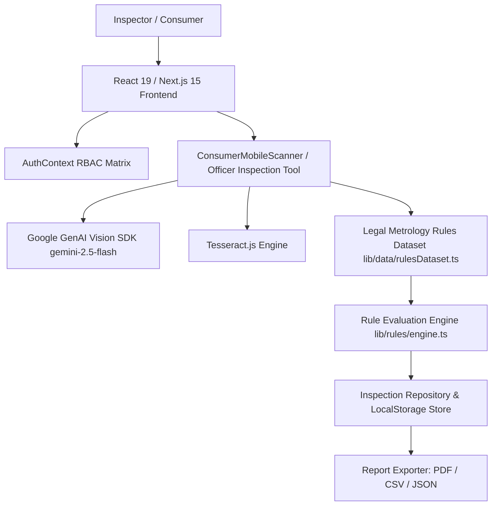

# Technical Architecture & Deployment Documentation

**Project**: LegalMatrix — Legal Metrology Compliance & Enforcement Infrastructure  
**Department**: Ministry of Consumer Affairs, Food & Public Distribution, Government of India  
**Legal Framework**: Legal Metrology Act, 2009 & Legal Metrology (Packaged Commodities) Rules, 2011 (amended up to 2026)

---

## 🏛️ 1. System Architecture Overview

LegalMatrix is engineered as a unified web & mobile compliance platform with dual interface capabilities:
1. **Officer Enforcement Portal**: High-density desktop interface for Legal Metrology Inspectors and Adjudicating Officers.
2. **Consumer Mobile View**: Smartphone application (`9:16` aspect ratio launcher) for public consumers and retail audits.



---

## 📜 2. Legal Metrology Rules Engine Architecture

### A. Rule 6(1) Mandatory 7 Declarations Check
Every pre-packaged commodity in India must carry 7 mandatory declarations:
1. **Rule 6(1)(a)**: Generic or Common Name of Commodity.
2. **Rule 6(1)(b)**: Net Quantity in legal metric units.
3. **Rule 6(1)(e)**: Maximum Retail Price (MRP) format with `"incl. of all taxes"`.
4. **Rule 6(1)(d)**: Month & Year of manufacture / packing / import (`MM/YYYY`).
5. **Rule 6(1)(ab)**: Name and complete address of Manufacturer / Packer / Importer with 6-digit postal PIN code.
6. **Rule 6(10A)**: Mandatory Country of Origin declaration for imported goods & e-commerce listings.
7. **Rule 6(1)(f)**: Complete Consumer Care contact details (phone / email / address).

### B. Rule 18 & Third Schedule Unit Symbol Standardization
Prohibits illegal non-standard unit symbols:
- **Allowed Legal Symbols**: `g`, `kg`, `mg`, `L`, `ml`, `m`, `cm`, `mm`.
- **Prohibited Illegal Symbols**: `gms`, `gms.`, `gm`, `lts`, `kgs`, `ctn`, `doz`.

### C. Rule 7 Table I Principal Display Panel (PDP) Font Height Thresholds
$$\text{Min Font Height (mm)} = f(\text{PDP Area } A \text{ in cm}^2)$$

| PDP Area ($A$) in cm² | Minimum Numeral Height (mm) | Minimum Moulded Height (mm) |
| :--- | :--- | :--- |
| $A \le 50$ | $1.0\text{ mm}$ | $1.5\text{ mm}$ |
| $50 < A \le 100$ | $1.5\text{ mm}$ | $3.0\text{ mm}$ |
| $100 < A \le 500$ | $2.5\text{ mm}$ | $4.0\text{ mm}$ |
| $500 < A \le 2500$ | $4.0\text{ mm}$ | $6.0\text{ mm}$ |
| $A > 2500$ | $6.0\text{ mm}$ | $6.0\text{ mm}$ |

---

## 🔒 3. Role-Based Access Control (RBAC) Matrix

| User Role | Identification | System Permissions |
| :--- | :--- | :--- |
| **Senior Legal Metrology Officer** | `LM-OFF-402` | Full Inspection, Seizure Memo Generation, Evidence Logging, PDF/CSV Export |
| **Adjudicating Magistrate** | `LM-MAG-101` | Judicial Review, Penalty Adjudication, Offence Compounding |
| **Registered Manufacturer** | `MFG-REG-882` | Self-Audit Label Pre-Screening, Registration Status Check |
| **Consumer Citizen** | `CITIZEN-992` | Shelf Product Verification, MRP Ceiling Calculator, Helpline 1915 Complaint Filing |

---

## 🚀 4. Production Deployment Framework

### Prerequisites
- Node.js v18.0.0 or higher
- Next.js 15+

### Environment Setup (`.env.local`)
```env
GEMINI_API_KEY=your_google_genai_api_key_here
NEXT_PUBLIC_GEMINI_API_KEY=your_google_genai_api_key_here
```

### Local Build & Run Commands
```bash
# 1. Install dependencies
npm install

# 2. Verify TypeScript strict types
npm run typecheck

# 3. Start local development server
npm run dev

# 4. Build production bundle
npm run build
npm run start
```

### Docker Container Deployment
```dockerfile
FROM node:20-alpine AS builder
WORKDIR /app
COPY package*.json ./
RUN npm ci
COPY . .
RUN npm run build

FROM node:20-alpine AS runner
WORKDIR /app
ENV NODE_ENV=production
COPY --from=builder /app ./
EXPOSE 3000
CMD ["npm", "start"]
```
